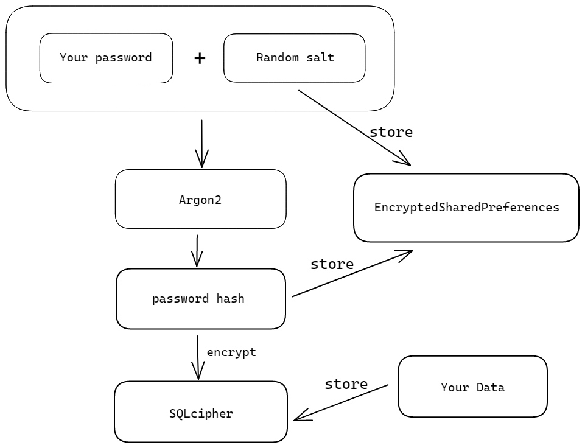

# secretNote
 自己写的一个简单的密码管理器

## 加密方法

使用 Argon2 对密码与随机生成的盐哈希，得到的哈希结果用于数据库加密；使用 Security 库存放盐与哈希结果；SQLcipher 使用默认的 AES256 对数据进行加密存储。

## 现有功能

- 密码箱：账号与密码的储存，可添加图片作为附件
- 文本记录箱：基于 [richeditor-android](https://github.com/wasabeef/richeditor-android) 的文本编辑器，可在文本中插入图片
- 卡包：存储卡号和密码，可添加图片作为附件

## 截图

|  |  |  |
| ---------------------------------------------------- | ---------------------------------------------------- | ---------------------------------------------------- |
|  |  |                                                      |

## 待实现

- [ ] 绘制一个应用图标
- [ ] 数据库的导入与导出
- [ ] 日/夜模式的切换
- [ ] 更好的界面、操作
- [ ] 更完善的设置选项
- [ ] 更好的代码实现

